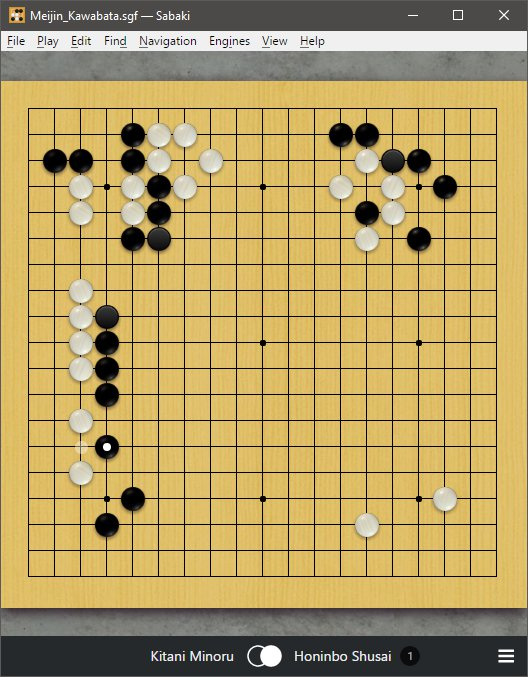

# wgo.js Theme for [Sabaki](http://sabaki.yichuanshen.de/)

I made this theme because I saw a request to make a high resolution theme for Sabaki that mimicked the wgo.js theme. While all the stone images have a resolution ~350 ppi, there are a variety of stone image sizes available ranging from 32x32 upto 512x512. This theme defaults to using the 128x128 stone image size, though the `style.css` may be modified to point to the desired stone images. There are a variety of woods available as well, though their resolution is lower, at 72 ppi. Since there was no background image, I kept the granite-grey background from my [walnut theme](https://github.com/3kakakhel/sabaki-walnut-theme) since it is fairly neutral without being a bland color.

Sourcing information is available in the Credits section below.
I hope you enjoy it. Improvements are welcome.

## Installation

* For Sabaki 31 or newer
* Download [wgojs.sabakitheme.asar](https://github.com/kakakhel/sabaki-wgojs-theme/releases)
* Preferences > Themes > Install Theme

## Credits

* I took the granite background image from [OGS](https://github.com/online-go/online-go.com/blob/devel/assets/img/granite.jpg).
* I took the default wooden board image from [wgo.js](https://github.com/waltheri/wgo.js/blob/master/wgo/wood1.jpg).
* I took the remaining wooden board image from [wgo.js](https://github.com/waltheri/wgo.js/tree/master/textures).
* The high resolution stone images used by this project come from the [go-assets](https://github.com/atarnowsky/go-assets) repository, available under a [Creative Commons Attribution-ShareAlike 4.0](http://creativecommons.org/licenses/by-sa/4.0/) International license. Copyright © 2016 [Andreas Tarnowsky](https://github.com/atarnowsky/go-assets/blob/master/andreas.tarnowsky@googlemail.com).

## License

Everything is released under [public domain](http://creativecommons.org/publicdomain/zero/1.0/).